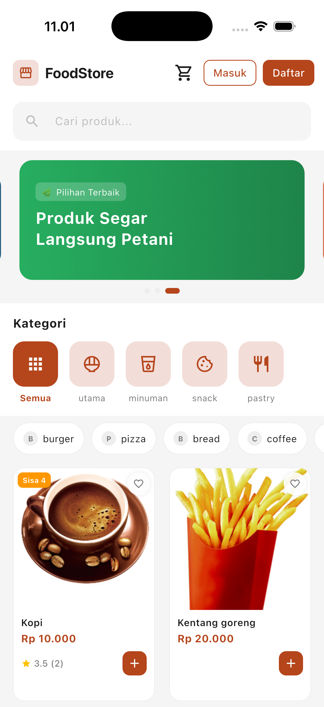

# Foodstore Mobile App

A full-featured food e-commerce mobile application built with Flutter & Dart. Users can browse food products, search and filter by category or tag, add to cart, checkout with saved delivery address, pay via Midtrans, track order status in real-time, confirm delivery, and review purchased items. Supports biometric authentication, Google Sign-In, push notifications, and offline detection.

## Feature

### Home



- [x] Product list (grid 2 kolom)
- [x] Search produk dengan debounce (500ms)
- [x] Filter kategori
- [x] Filter tags (multi-select)
- [x] Banner carousel
- [x] Header dengan cart badge + tombol Masuk & Daftar
- [x] Badge "Sisa n" di product card saat stok ≤ 5
- [x] Disable tombol "+" di product card kalau qty di cart sudah mencapai stok
- [x] Skeleton loading (shimmer) saat produk loading
- [x] Pagination (prev / next page)

---

### 🚧 Coming Soon

**Auth**

- [ ] Login (email + password)
- [ ] Register
- [ ] Auto login — cek token saat buka app, redirect otomatis
- [ ] Logout
- [ ] Guest mode — beranda bisa diakses tanpa login
- [ ] Biometric auth — fingerprint / Face ID setiap buka app & kembali dari background; cache tetap ada, hanya auth gate yang di-reset
- [ ] Google Sign-In native — OAuth native flow, butuh endpoint `POST /auth/google/mobile` di backend

**Home**

- [ ] Product list (grid 2 kolom)
- [ ] Search produk dengan debounce (500ms)
- [ ] Filter kategori
- [ ] Filter tags (multi-select)
- [ ] Banner carousel
- [ ] Header dengan cart badge + user avatar
- [ ] Badge "Sisa n" di product card saat stok ≤ 5
- [ ] Disable tombol "+" di product card kalau qty di cart sudah mencapai stok

**Cart**

- [ ] Tambah ke cart (guest → redirect login)
- [ ] Cart badge count di header (realtime)
- [ ] Cart icon loading saat mutasi berjalan
- [ ] Empty state "Keranjang kosong" saat cart tidak ada isi
- [ ] Checkbox per item + Pilih Semua
- [ ] Hapus item yang di-check via tombol "Hapus"
- [ ] Ikon trash per item — hapus satu item langsung
- [ ] Update qty; qty → 0 otomatis hapus item dari cart
- [ ] Subtotal per item tampil di kanan setiap card
- [ ] Card items disabled (opacity 0.6) saat mutasi berjalan
- [ ] Ringkasan belanja (subtotal + ongkir Rp 20.000 + total) — hanya tampil jika ada item yang di-check
- [ ] Tombol "Beli (n)" — hanya muncul jika ada item yang di-check, meneruskan hanya item `checked = true` ke Checkout

**Checkout**

- [ ] 3-step checkout flow dengan stepper UI
- [ ] Step 1: Review item pesanan — hanya item yang `checked = true` dari cart
- [ ] Step 2: Pilih alamat pengiriman dari daftar saved addresses (dengan radio select)
- [ ] Step 3: Konfirmasi — ringkasan alamat, item, subtotal, ongkir (Rp 20.000), dan total pembayaran
- [ ] Buat order via `POST /api/orders` → langsung navigate ke InvoiceScreen

**Invoice & Pembayaran**

- [ ] Invoice card — nomor invoice, status badge (Lunas), stepper 4 tahap (Pembayaran → Diproses → Dikirim → Diterima)
- [ ] Status banner per kondisi: Menunggu Pembayaran, Dikonfirmasi, Diproses, Dalam Pengiriman, Diterima, Gagal
- [ ] Tombol "Bayar Sekarang" saat status `waiting_payment`
- [ ] Midtrans Snap popup via WebView (inject Snap.js sandbox) — dipicu dari InvoiceScreen
- [ ] Callback Snap.js via `postMessage`: `success`, `pending`, `error`, `close`
- [ ] Verifikasi pembayaran via `GET /api/payments/verify/:order_id` setelah sukses
- [ ] Tombol "Konfirmasi Diterima" saat status `in_delivery`
- [ ] Tombol "Beri Rating" per item saat status `delivered`
- [ ] Info pengiriman (alamat), info pembayaran (nama + email user), item pesanan, ringkasan harga

**Realtime & Notifikasi**

- [ ] FCM push notification — status order update dikirim dari backend, diterima di foreground, background, dan terminated; tap notif langsung navigate ke InvoiceScreen

**Profile**

- [ ] Biodata diri (nama, email, role, customer ID, login via Google)
- [ ] Ganti tema warna (Green Fern, Green Jade, Merah, Biru, Orange)
- [ ] Image picker untuk avatar profile — kamera + galeri, upload ke `PUT /api/users/avatar` (Cloudinary), foto langsung update di hero section

**Riwayat Belanja**

- [ ] Tab "Riwayat Belanja" di Profile — daftar semua order dari `GET /api/orders`
- [ ] Setiap row: ikon, "Order #n", tanggal, total harga, badge status (Menunggu/Diproses/Dikirim/Lunas/Gagal)
- [ ] Tap order → navigate ke InvoiceScreen
- [ ] Banner "n pesanan menunggu pembayaran" — collapsible, expand tampilkan list order waiting
- [ ] Tap order di banner → langsung ke InvoiceScreen order tersebut

**Tema**

- [ ] Multi-tema — Green Fern, Green Jade, Merah, Biru, Orange
- [ ] Token warna terpusat di constants/themes.dart
- [ ] Ganti tema dari Profile → tab Keamanan
- [ ] Dark mode — tambah variant `dark` per token warna

**Wishlist**

- [ ] Toggle wishlist dari product card (ikon hati merah/abu-abu)
- [ ] Wishlist disinkron via `GET /api/wishlists` — heart langsung update saat buka HomeScreen
- [ ] Tambah ke wishlist via `POST /api/wishlists { product_id }`
- [ ] Hapus dari wishlist via `DELETE /api/wishlists/:product_id`
- [ ] Tab "Favorit" di ProfileScreen — daftar produk favorit dengan thumbnail, nama, harga
- [ ] Hapus dari favorit langsung via tombol hati di tab Favorit

**Product Detail**

- [ ] Tap product card di Home → buka detail screen
- [ ] Tap item di tab Favorit → buka detail screen
- [ ] Gambar produk full-width, nama, harga, kategori, tags, deskripsi, stok
- [ ] Tombol "Tambah ke Keranjang" dengan loading state & disable saat stok habis / penuh
- [ ] Toggle wishlist (hati) di header detail screen dengan loading state
- [ ] Fetch via `GET /api/products?q=name` — filter by `_id`

**Review Produk**

- [ ] Tombol "Beri Rating" per item di InvoiceScreen saat status `delivered`
- [ ] Bottom sheet modal: star rating 1–5 (tap), kolom komentar, label rating (Sangat Buruk–Sangat Bagus)
- [ ] Submit via `POST /api/reviews { product_id, order_id, rating, comment }`
- [ ] Error inline di modal — termasuk pesan duplikat dari backend
- [ ] Tombol "Beri Rating" hilang setelah berhasil submit atau terdeteksi sudah pernah diulas
- [ ] List review per produk tampil di bawah setiap item via `GET /api/reviews?product_id=X`
- [ ] Nama reviewer + bintang + komentar ditampilkan per review

**Alamat Pengiriman**

- [ ] CRUD alamat di tab "Alamat Pengiriman" ProfileScreen
- [ ] List alamat tersimpan (nama, wilayah, detail) dengan tombol edit & hapus
- [ ] Form tambah / edit alamat via bottom sheet modal
- [ ] Cascading region picker: Provinsi → Kabupaten → Kecamatan → Kelurahan (dengan search)
- [ ] Data wilayah dari `GET /api/wilayah/provinsi|kabupaten|kecamatan|desa`
- [ ] Konfirmasi hapus alamat via Alert

**Product & UX**

- [ ] Infinite scroll — `GET /api/products` + `GET /api/orders`; `limit:5`, `skip` per page
- [ ] Skeleton loading — shimmer placeholder di HomeScreen (product grid), ProductDetailScreen, ProfileScreen Riwayat tab
- [ ] Average rating di ProductCard (⭐ 4.2 · count) dan ProductDetailScreen (5 bintang + avg + jumlah ulasan)
- [ ] Search history — simpan pencarian terakhir (maks 8), tampil saat search fokus + kosong; tap untuk isi ulang, hapus per item, hapus semua

**Infrastruktur**

- [ ] Deep linking — buka InvoiceScreen / ProductDetailScreen langsung dari notifikasi atau external link
- [ ] Offline banner — deteksi koneksi hilang, tampil banner, retry otomatis saat online kembali

## Project Structure

```
lib/
├── core/
│   ├── network/
│   │   ├── dio_client.dart        # HTTP client singleton + BaseOptions
│   │   └── log_interceptor.dart   # Request/response logger (debug only)
│   ├── theme/
│   │   ├── app_colors.dart        # Color tokens
│   │   └── app_theme.dart         # ThemeData
│   └── utils/
│       └── image_url.dart         # Normalisasi URL gambar dari server
├── features/
│   ├── cart/
│   │   └── provider/
│   │       └── cart_provider.dart # State management keranjang
│   └── home/
│       ├── data/
│       │   └── home_repository.dart  # Fetch products, categories, tags
│       ├── model/
│       │   ├── category.dart      # Model kategori
│       │   ├── product.dart       # Model produk
│       │   └── tag.dart           # Model tag
│       ├── provider/
│       │   └── home_provider.dart # HomeState + HomeNotifier
│       └── screen/
│           └── home_screen.dart   # UI beranda
├── shared/
│   └── widgets/
│       └── product_card.dart      # Card produk (reusable)
└── main.dart
```
## Tech Stack

| Kategori | Package |
|---|---|
| Framework | Flutter + Dart |
| Navigation | go_router (+ deep linking) |
| HTTP Client | dio + interceptor JWT |
| State Management | flutter_riverpod (auth, cart, tema, wishlist) |
| Form & Validasi | reactive_forms |
| Storage (secure) | flutter_secure_storage (token) |
| Storage (umum) | shared_preferences (search history, tema) |
| Cache Gambar | cached_network_image |
| Biometric | local_auth |
| Google Sign-In | google_sign_in |
| Image Picker | image_picker |
| WebView (Midtrans) | webview_flutter |
| Carousel | carousel_slider |
| Skeleton/Shimmer | shimmer |
| Infinite Scroll | infinite_scroll_pagination |
| Realtime | pusher_channels_flutter |
| Push Notifikasi | firebase_messaging + flutter_local_notifications |
| Konektivitas | connectivity_plus |
| Debounce | rxdart |

## Backend

Base URL: `https://foodstore-server-nu.vercel.app`
